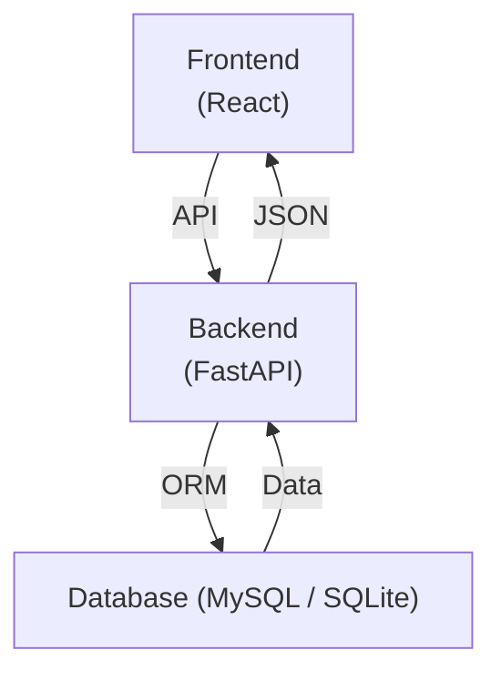

# 💸 SmartSub – Subscription & Expense Manager


---

## 🧠 About the Project

**SmartSub** is a full-stack web application that helps users track and manage recurring subscriptions and fixed expenses in one place.

It solves a common problem: losing control over small, scattered monthly payments (streaming services, gym memberships, apps, etc.). SmartSub provides a **clear dashboard, categorization, and payment tracking**, allowing users to quickly identify unnecessary expenses.

🌐 **Live version:** https://neeklines.xyz

🛠️ **Local setup:** available below (see [Getting Started](#-getting-started))

---

## ✨ Features

### 🔐 Authentication

* User registration & login
* Secure password handling
* Session / token-based authentication

### 📊 Dashboard

* Total monthly and yearly expenses
* Clear financial overview
* Fast and responsive UI

### 📦 Subscription Management

* Add, edit, delete subscriptions
* Support for both:

  * Popular services
  * Custom user-defined expenses

### 🗂️ Categorization

* Group expenses into categories (e.g. Entertainment, Health, Housing)
* Better organization and filtering

### 📅 Payment Tracking

* Upcoming payments list
* Sorted by nearest due date
* Easy identification of upcoming charges

### 📱 Responsive UI

* Works on desktop and mobile
* Clean and modern interface

---

## 🏗️ Architecture



---

## 🛠️ Tech Stack

**Frontend**

* React.js
* Modern JS (ES6+)
* CSS / UI components

**Backend**

* FastAPI (Python)
* REST API design
* Authentication & business logic

**Database**

* MySQL (production)
* SQLite (development)

---

## 📁 Project Structure

```plaintext id="str91x"
uni-web-app-pro/
├── frontend/                 # React frontend
│   ├── src/
│   └── public/
│
├── backend/                 # FastAPI backend
│   ├── tests/
│   └── app/
│       ├── routers/
│       ├── models/
│       ├── schemas/
│       └── services/
│
├── database/               # DB config / migrations
├── public/                 # Static files
├── .env
├── .gitignore
├── .flake8
├── README.md
├── SCOPE.md
├── CONTRIBUTINGS.md
└── LICENSE.md
```

---

## 🚀 Getting Started

### 1️⃣ Clone Repository

```bash id="clone11"
git clone https://github.com/Neeklines/uni-web-app-pro
cd uni-web-app-pro
```

---

### 2️⃣ Backend Setup (FastAPI)

```bash id="backend22"
cd backend
python -m venv venv
source venv/bin/activate   # Windows: venv\Scripts\activate

pip install -r requirements.txt
uvicorn app.main:app --reload
```

Backend runs at:

```id="backend-url"
http://localhost:8000
```

---

### 3️⃣ Frontend Setup (React)

```bash id="frontend33"
cd frontend
npm install
npm start
```

Frontend runs at:

```id="frontend-url"
http://localhost:3000
```

---

### ⚙️ Environment Configuration

Create a `.env` file in the backend directory:

```env id="env44"
DATABASE_URL=your_database_url
RUN=prod/dev
```

---

## 🧠 Learning Goals

This project focuses on:

* Full-stack web development (React + FastAPI)
* Designing and building REST APIs
* Working with relational databases (MySQL, SQLite)
* Authentication and security basics
* State management and frontend architecture
* Building clean, user-focused UI/UX

---

## 👥 Team

* **Yehor Timofieiev** - Team lead
* **Ostap Lishchynskyi**
* **Alina Skyba**
* **Filip Furdyna** - Frontend dev
* **Bartosz Mroczek**
* **Jakub Fuhrman**
* **Sebastian Gęborys**

---

## 📄 Useful information

License is in `LICENSE.md` file. See it for details.

To contribute, please see `CONTRIBUTIONS.md` for details.

Project scope is defined in `SCOPE.md`.
